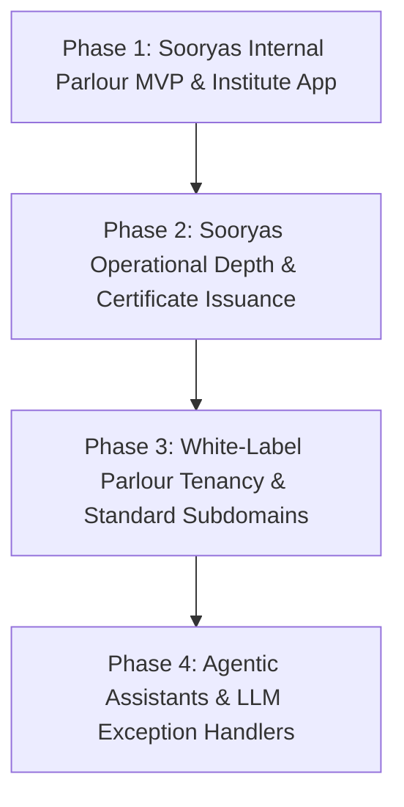

# Business Requirements Document: SooryasWeb / lifefil.ai Salon OS

Version: 1.0 (Consolidated)  
Date: 4 June 2026  
Status: Final Approved Single Source of Truth  
Product Name: SooryasWeb / lifefil.ai Salon OS  
Primary Tenant: Soorya's Skin Hair and Makeup, Kumarapuram, Thiruvananthapuram  
Platform Owner/Domain: `lifefil.ai`  

---

## 1. Executive Summary

SooryasWeb is a white-label, browser-based operating system for beauty parlours and salon businesses. The platform is designed to be highly structured, tracking bookings, invoices, payments, staff commissions, and inventory. 

Confirmed owner decision: the requirements are split into two completely separate applications and databases:

1. **SooryasWeb Parlour App (This Repository):** Evolving from the current codebase. Evolved to run Soorya's daily parlour operations, with a tenant-aware schema from day 1 (`tenant_id` on all tables) to support future entrepreneurs (e.g., `rosebeauty.lifefil.ai`) as independent tenants. Includes staff-managed bookings, CRM, GST-ready invoicing, payment logging, staff commissions, inventory, manual WhatsApp links, and business dashboards.
2. **Sooryas Institute App (Separate Repository & Database):** A completely separate application and database dedicated to Soorya's training institute. Includes batch management, admissions, fee ledgers, attendance, assessments, completion certificates, and its own public landing page for admissions.

---

## 2. Product Vision

The long-term vision is to establish a repeatable operating system for beauty businesses: one platform that can run a parlour efficiently today, train future beauty entrepreneurs tomorrow, and eventually support agentic automation without a complete system redesign.

For Sooryas, the product line proves the training USP:
> Train in a real parlour. Build a real beauty-care career.

By managing parlour operations and institute trainee metrics in structured databases, the systems provide concrete proof that trainees are learning within a live, disciplined operational environment.

---

## 3. Business Objectives

### 3.1 Platform Objectives (SooryasWeb Parlour)
1. Build a repeatable, tenant-aware parlour operating system under `lifefil.ai`.
2. Support future white-label parlour tenants with subdomain routing, tenant-specific logos, and strict data isolation.
3. Establish a low-cost introductory pricing model of **Rs. 499/month** for future parlour tenants.
4. Maintain a foundation-first build sequence: requirements traceability, tenant-aware MySQL-compatible data model, RBAC, deployment safety, and a comprehensive test harness before feature delivery.

### 3.2 Sooryas Parlour Tenant Objectives
1. Run daily parlour workflows smoothly across mobile, tablet, and desktop.
2. Prevent double-booking conflicts by enforcing checks **both per staff member and per chair/station**.
3. Drive invoicing discipline: every completed billable service must generate a GST-ready invoice.
4. Capture client profiles, service histories, and basic consent/interaction notes.
5. Enable basic, cost-free WhatsApp workflows via manual redirect links (`wa.me`).

### 3.3 Sooryas Institute Objectives (Separate App)
1. Manage the 4-month, Rs. 60,000 training program for the inaugural batch.
2. Track admissions enquiries, batch schedules, attendance, instalment fee ledgers, and exams.
3. Monitor first-batch launch readiness metrics: target of 15 enrolled students and a validation threshold of 12 paid student bookings.
4. Provide a public admissions landing page to attract and register trainee enquiries.
5. Generate verified completion certificates featuring both a QR code and lookup code.

---

## 4. Product Scope

### 4.1 In Scope: SooryasWeb Parlour App (Phase 1)
- **Tenant-Aware Schema:** Database structure contains `tenant_id` on all relevant tables to ensure logical data isolation and future scaling.
- **Production Authentication:** Staff and tenant users authenticate through approved portal accounts mapped to tenant and role. The current username/password flow is private-preview only and must be hardened before real customer data is used.
- **Staff-Managed Bookings:** Appointment scheduling, rescheduling, cancellations, and status tracking (pending, confirmed, completed, cancelled, no-show).
- **Double-Booking Prevention:** Conflict detection logic checks both staff availability and chair/station availability.
- **Customer CRM:** Contact information, tags, service history, preferences, and basic consent/interaction notes.
- **Billing & Invoices:** Invoice generation for all completed services. Configurable, optional GST/tax fields. Standardized invoice template with tenant logo.
- **Payment Logging:** Log at-premises payment modes (UPI, card, cash) and payment reference numbers.
- **Staff Commissions:** Automatic calculation of commissions based on defined rules. Audit logging for manual commission overrides.
- **Basic Inventory:** Product and consumable tracking, stock deductions upon service completion/sale, and low-stock alerts.
- **WhatsApp Integration:** Low-cost manual WhatsApp message triggers using `wa.me` links for appointment confirmations, reminders, and invoice sharing.
- **Analytics Dashboards:** Daily/weekly/monthly sales, repeat customer trends, staff productivity, and commission summaries.
- **Bilingual Interface:** A language toggle (English / Malayalam) for the user interface.

### 4.2 In Scope: Sooryas Institute App (Phase 1 - Separate Repo & DB)
- **Public Admissions Landing Page:** Landing page for prospective students to submit course enquiries.
- **Enquiry & Admissions Funnel:** Capture lead details, lead sources (WhatsApp, Instagram, referral, walk-in, poster, demo day), and student career goals.
- **Batch & Course Management:** Configure batches, dates, course fees (default Rs. 60,000), trainer assignments, and batch capacity.
- **Instalment Fee Ledger:** Record payments, calculate outstanding balances, and track overdue instalments.
- **Attendance Tracker:** Daily attendance logs for trainees.
- **Assessments & Exams:** Record module-wise test scores and examiner names.
- **Completion Certificates:** Generate and verify student completion certificates containing both a QR code and lookup verification code.

### 4.3 Out of Scope for Phase 1 (Both Apps)
- Customer self-booking.
- Online payment gateway integration (only manual recording of at-premises payments).
- Paid WhatsApp Business API integration (using free manual links only).
- Multi-branch/franchise administration dashboards.
- Dynamic custom invoice layout editors per tenant.
- Trainer rentals (Dropped from requirements).
- Marketing campaign ROI tracking (Deferred).
- Advanced AI/agentic automation (No AI features in Phase 1; deterministic rule-based logic only).
- Deep medical/skin/hair categories for customer notes (Limited to basic operational notes until legal policy review).

---

## 5. Operating & Technical Model

### 5.1 Project & Database Separation
The Parlour and Institute systems are completely decoupled:
- **Repositories:** Two distinct Git repositories.
- **Databases:** Two separate databases.
- **Deployments:** Deployed as separate web applications.
- **Reasoning:** Ensures complete data isolation, keeps the tenant parlour codebase lightweight, and maintains the privacy of Sooryas training operations.

### 5.2 Database Environment
- **Development:** Local PostgreSQL running via Docker on Windows for the current test harness.
- **Production:** GoDaddy managed MySQL for the parlour app.

### 5.3 Tenant Model (Parlour App)
- Subdomains (e.g., `sooryas.lifefil.ai`, `rosebeauty.lifefil.ai`) route to tenant contexts.
- Each tenant maintains their own configuration: business name, address, optional GSTIN, staff list, services catalogue, and logo.
- The invoice layout remains standardized; only the logo, tenant details, and line items change.

### 5.4 Localization & Language
- **User Interface:** UI supports a language toggle to switch between English and Malayalam.
- **Data Storage:** A single Unicode field is used per text input (e.g., customer name, service notes) to accept and store characters from either script without database duplication.

---

## 6. User Roles and Access

### 6.1 SooryasWeb Parlour App Roles
- **Platform Super Admin:** Full access to manage all parlour tenants, subscriptions, and platform settings.
- **Parlour Tenant Owner (e.g., Soorya):** Full administrative control over their specific parlour tenant instance.
- **Salon Manager:** Access to booking calendars, staff assignments, invoices, inventory tracking, and reports.
- **Receptionist:** Access to create/edit bookings, manage customer records, record payments, and trigger WhatsApp links.
- **Beautician/Staff:** View assigned bookings, check individual commission reports, and view permitted customer notes.
- **Accountant:** Read-only access to invoice logs, payment records, commission audits, and financial reports.

### 6.2 Sooryas Institute App Roles
- **Institute Owner (Soorya):** Full access to batches, fee reports, attendance, assessments, and certificate approvals.
- **Trainee Admin:** Manage batches, register enrolments, record fee instalments, and trigger overdue notifications.
- **Trainer:** Record daily trainee attendance and enter assessment scores.

---

## 7. Core Business Rules

| Rule ID | Rule Statement |
|---|---|
| **BR-01** | Only salon staff can manage bookings (No customer self-booking in Phase 1). |
| **BR-02** | Booking conflict prevention must check both staff availability and station/chair availability. |
| **BR-03** | Invoices must be generated for all completed services; payment collection and invoicing are separate steps. |
| **BR-04** | GST details are optional and configurable; invoices function with or without GST fields populated. |
| **BR-05** | Customer CRM notes must be limited to basic interaction and preference logs. Deep skin, hair, and medical history tracking is locked pending legal review. |
| **BR-06** | Parlour database tables must contain a `tenant_id` column to enforce strict data isolation between tenants, and production access must map authenticated portal users to approved tenant roles. |
| **BR-07** | The Parlour app and the Institute app must remain completely decoupled, running in separate repositories and using separate databases. |
| **BR-08** | WhatsApp workflows must use free manual links (`wa.me`) or equivalent free mechanisms. Paid message templates or APIs are out of scope. |
| **BR-09** | Staff commission rules must be versioned, and manual overrides must generate an audit log. |
| **BR-10** | Trainee certificates can only be generated when all eligibility rules (attendance, fees paid, assessment completion) are met. |

---

## 8. Functional Requirements

### 8.1 Parlour Administration & Tenancy
- **FR-TA-01:** System separates tenant data using a tenant-aware database schema (`tenant_id` filtering).
- **FR-TA-02:** Platform administrators can onboard new parlour tenants, assign subdomains, and set active/inactive status.
- **FR-TA-03:** Parlour tenants can upload their own logo and configure address, contact details, and optional GSTIN.
- **FR-TA-04:** Production authentication must use approved portal users mapped to tenant and role. Public self-registration must not grant usable portal access.

### 8.2 Parlour Bookings
- **FR-BK-01:** Staff can create, view, edit, reschedule, and cancel bookings.
- **FR-BK-02:** Visual booking calendar showing schedules categorized by stylist/staff and chair/station.
- **FR-BK-03:** Automatic conflict detection: system blocks saving if the selected staff OR the selected chair is already booked.
- **FR-BK-04:** Record the lead source for booking (WhatsApp, phone, Instagram, referral, walk-in).

### 8.3 Customer CRM (Parlour)
- **FR-CRM-01:** Store customer name, contact details, tags, preferences, and basic notes.
- **FR-CRM-02:** Retrieve customer history showing past bookings, services completed, and stylists assigned.
- **FR-CRM-03:** Store basic consent records (signed/unsigned date flag) without detailed medical logs.

### 8.4 Invoicing & Payments (Parlour)
- **FR-BI-01:** Create a GST-ready invoice detailing service items, pricing, discounts, and optional tax breakdown.
- **FR-BI-02:** Maintain unique sequential invoice numbers per tenant, reset per financial year.
- **FR-BI-03:** Record payments by logging the mode (UPI, card, cash), amount, reference ID, and payment date.
- **FR-BI-04:** Separate payment ledger allowing partial payment logging and final payment reconciliation.

### 8.5 Staff & Commissions (Parlour)
- **FR-ST-01:** Configurable staff profiles containing active status, roles, and scheduled availability.
- **FR-ST-02:** Configure commission rules (e.g., fixed rate or percentage per service).
- **FR-ST-03:** Automatically calculate commission summaries for completed invoices.
- **FR-ST-04:** Support manager override of calculated commissions, requiring an audit reason.

### 8.6 Inventory Management (Parlour)
- **FR-INV-01:** Maintain inventory catalogue of products (retail) and consumables (backbar).
- **FR-INV-02:** Automatically decrement stock count upon service checkout (for configured consumables) or direct retail sale.
- **FR-INV-03:** Highlight low-stock items on the manager dashboard when stock levels fall below defined thresholds.

### 8.7 WhatsApp Redirection (Parlour)
- **FR-WA-01:** Generate a pre-filled `wa.me` message link for booking confirmations (contains date, time, service).
- **FR-WA-02:** Generate a pre-filled `wa.me` message link for invoices (contains invoice summary, totals, and payment confirmation).

### 8.8 Sooryas Institute Module (Institute App Requirements)
- **FR-IN-01:** Manage batch details: course name, start/end dates, fees (default Rs. 60,000), trainer, and student capacity.
- **FR-IN-02:** Manage trainee profiles including batch assignment, target career goal, and admissions checklist.
- **FR-IN-03:** Record daily attendance logs per batch.
- **FR-IN-04:** Manage instalment fee schedules (Booking fee + 4 instalments) and record trainee payments.
- **FR-IN-05:** Track assessment records (module exams, grades, and examiner comments).
- **FR-IN-06:** Generate completion certificates with a unique lookup code and a QR code pointing to a public verification page.
- **FR-IN-07:** Dashboard tracking batch launch readiness (counting enquiries and verifying the 12-paid-bookings go/no-go threshold).

---

## 9. Data Requirements (Schema Outline)

### 9.1 Parlour Database Entities
- **Tenants:** `id`, `name`, `subdomain`, `logo_url`, `gstin`, `address`, `phone`, `created_at`
- **Users:** `id`, `tenant_id`, `username`, `password_hash`, `role`, `email`, `status`, `created_at`
- **Customers:** `id`, `tenant_id`, `name`, `phone`, `email`, `notes`, `consent_status`, `consent_date`, `created_at`
- **Staff:** `id`, `tenant_id`, `name`, `phone`, `role`, `commission_type`, `commission_value`, `status`
- **Services:** `id`, `tenant_id`, `name`, `duration_minutes`, `price`, `tax_class`, `is_active`
- **Bookings:** `id`, `tenant_id`, `customer_id`, `staff_id`, `chair_id`, `service_id`, `start_time`, `end_time`, `status`, `source`, `created_at`
- **Invoices:** `id`, `tenant_id`, `invoice_number`, `customer_id`, `subtotal`, `tax_total`, `discount_total`, `grand_total`, `status`, `created_at`
- **InvoiceItems:** `id`, `invoice_id`, `service_id`, `quantity`, `unit_price`, `tax_amount`
- **Payments:** `id`, `tenant_id`, `invoice_id`, `amount`, `payment_mode`, `reference_number`, `payment_date`
- **InventoryItems:** `id`, `tenant_id`, `name`, `type` (retail/consumable), `stock_quantity`, `reorder_level`, `vendor_name`
- **AuditLogs:** `id`, `tenant_id`, `user_id`, `action`, `entity_name`, `entity_id`, `timestamp`, `details`

### 9.2 Institute Database Entities
- **Batches:** `id`, `course_name`, `start_date`, `end_date`, `course_fee`, `capacity`, `status`
- **Trainees:** `id`, `batch_id`, `name`, `phone`, `email`, `career_goal`, `enrollment_status`, `created_at`
- **Attendance:** `id`, `trainee_id`, `batch_id`, `date`, `status` (present/absent/excused)
- **FeeLedger:** `id`, `trainee_id`, `due_date`, `amount_due`, `amount_paid`, `status` (pending/paid/overdue), `payment_date`, `receipt_number`
- **Assessments:** `id`, `trainee_id`, `module_name`, `score`, `result` (pass/fail), `examiner_name`, `date`
- **Certificates:** `id`, `trainee_id`, `issue_date`, `verification_code`, `qr_code_url`
- **Enquiries:** `id`, `name`, `phone`, `source` (WhatsApp, Instagram, etc.), `goal`, `status`, `created_at`

---

## 10. Automation & Agentic Readiness

Phase 1 relies on deterministic codebase workflows to control costs and ensure high reliability. No live LLM integrations are used for automations in the initial MVP.

- **Booking Reminders:** Built as a deterministic script that generates template text and provides receptionist-clicked `wa.me` links.
- **Commission Calculations:** Executed via database logic upon invoice status transitioning to "Paid".
- **Stock Alert Triggers:** Deterministic stock deductions trigger a flag when inventory falls below `reorder_level`.
- **Certificate Verification:** Lookup codes are verified deterministically via public database query endpoints.

---

## 11. Release Phases

### Phase 1: Sooryas Internal Parlour MVP & Separate Institute App
- **Parlour App:** Build local dev environment, deploy to GoDaddy Node.js with managed MySQL, and establish Auth/RBAC, calendar scheduling, conflict detection (staff + chair), invoice logging, payment ledger, basic inventory, and manual WhatsApp redirect links.
- **Institute App:** Setup a separate repository and database. Build the public admissions landing page, enquiry log, fee ledger, and trainee tracking.

### Phase 2: Sooryas Operational Depth
- Trainee attendance and exam grading.
- Student certificate generation with QR and lookup verification.
- Low-stock warnings and payment reconciliation reports.

### Phase 3: White-Label Platform Foundation
- Enable subdomain routing.
- Implement multi-tenant onboarding, tenant logos, and subscription plans (Rs. 499/month pricing engine).

### Phase 4: Selective AI Assistants
- Optional LLM-driven daily summary reports for the owner.
- Customer history draft builders.

---

## 12. Resolved Owner Decisions (Historical Summary)

All project ambiguities have been resolved by the owner as follows:
- **D-01 (Document Authority):** `BRD.md` is consolidated as the single source of truth. `PRODUCT_BRD.md` and `business-requirements-document.md` are removed.
- **D-02 (Build Order):** Foundation-first build sequence (traceability -> database model -> auth -> test harness -> feature execution).
- **D-03 (Database):** GoDaddy managed MySQL is the production database for the parlour app; the Institute app keeps its own separate database.
- **D-04 (Database Architecture):** Decoupled databases: Parlour and Institute have completely separate databases.
- **D-05 (Codebase):** Two separate Git repositories: one for the parlour app (evolved from this repo) and one for the institute app.
- **D-06 (Multi-tenancytiming):** Parlour schema is tenant-aware from day 1 (`tenant_id`), but multi-tenancy deployment is deferred.
- **D-07 (Bilingual UI):** Language toggle for UI (English/Malayalam) with single Unicode text fields in the database.
- **D-08 (Development Env):** PostgreSQL currently runs locally on Docker for the existing test harness; production uses GoDaddy managed MySQL.
- **D-09 (Certificate Verification):** Certificates must support both a QR code and lookup code.
- **D-10 (Booking Conflicts):** Conflict checking must validate both staff availability and chair/station availability.
- **D-11 (WhatsApp Integrations):** Restricted to free manual WhatsApp links (`wa.me`) in Phase 1.
- **D-12 (GST Fields):** Invoice schema contains GST fields, but they are optional and configurable.
- **D-13 (Public Admissions Site):** Yes, the separate Institute app must include its own public admissions landing page.
- **D-14 (Student Photos):** Manage trainee portfolios in-app (requires a file storage strategy).
- **D-15 (Customer Consent/Notes):** Limit to basic operational notes; detailed skin/hair/medical history notes are deferred.
- **D-16 (Trainer Rentals):** Dropped from requirements.
- **D-17 (Marketing Tracking):** Campaign tracking is deferred.
- **D-18 (Parlour Pricing):** Parlour suite introductory pricing is Rs. 499/month.
