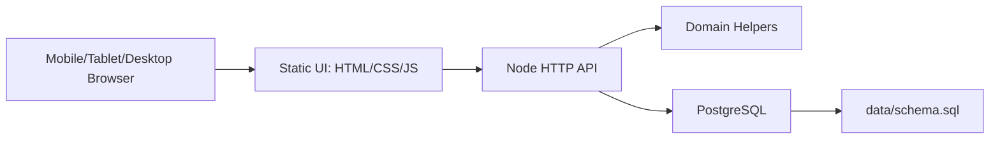
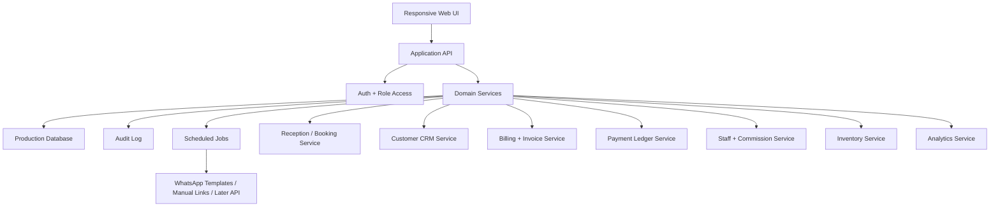

# Architecture

Source of truth: `BRD.md`  
Agent planning source: `coding-agents-needed.md` and `future-agent-manifest.yaml`

## 1. Current Prototype Architecture

The current codebase is a Node.js prototype that has started moving toward the BRD direction by adding PostgreSQL.

This is useful for validating parlour workflows, but it is not yet the full production architecture described in the BRD.

## 2. Target Phase 1 Architecture

Phase 1 should prioritize Sooryas internal readiness, with deterministic services before AI.

## 3. Service Boundaries

| Service | Responsibility |
|---|---|
| Workflow Orchestrator | Deterministic event routing between services. |
| Reception / Booking | Bookings, availability, rescheduling, cancellations, no-show status. |
| Customer CRM | Customer profile, notes, consent, preferences, service history. |
| Billing / Invoice | Invoice numbering, line items, tax fields, totals, invoice status. |
| Payment Ledger | At-premises payment modes, references, balances, reconciliation. |
| Staff & Commission | Staff profiles, schedules, commission rules, payout summaries. |
| Inventory | Products, consumables, stock movements, low-stock alerts. |
| WhatsApp Concierge | Template/manual-link messaging, reminders, invoice sharing, delivery logs. |
| Audit / Compliance | Immutable write log, override reasons, policy warnings. |
| Analytics | Query-based dashboards and reports. |

## 4. Data Storage Direction

Current direction:

- PostgreSQL for the parlour app in this repository.
- A separate PostgreSQL database for the future Sooryas Institute app.

Either path should include:

- migrations;
- audit log tables;
- backup strategy;
- explicit role/permission tables;
- indexed records for bookings, invoices, payments, students, and inventory.

## 5. AI and Agent Architecture

Phase 1 agents should be implemented as deterministic services, not model-driven agents.

AI can be added later for:

- owner narrative summaries;
- long customer-history summaries;
- draft-only WhatsApp replies;
- exception explanations;
- institute follow-up suggestions.

AI must not silently execute high-impact actions such as invoices, commission overrides, certificate issuance, or sensitive customer-note edits.

## 6. Production Evolution

Recommended technical sequence:

1. Add auth and role access.
2. Harden PostgreSQL schema, migrations, and seed strategy.
3. Add audit log.
4. Add booking/customer/invoice/payment/commission services.
5. Add WhatsApp template/manual-link workflow.
6. Add inventory and analytics modules.
7. Add deterministic scheduled jobs.
8. Add white-label tenancy later.
9. Add selective AI only after stable workflows.
