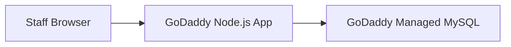

# Deployment

Target platform: **GoDaddy Node.js beta hosting**  
Target app: **root Node.js app in `SooryasWeb`**  
Target database: **GoDaddy managed MySQL**

## 1. Hosting Shape



This repo no longer uses a separate frontend/serverless deployment path. Deploy the root Node application from `SooryasWeb`.

## 2. GoDaddy App Settings

Use these settings in the GoDaddy Node.js app panel:

```text
Root directory: SooryasWeb
Build command: npm install && npm run build
Start command: npm start
Node version: 22 or later
```

The root `package.json` includes:

- `main`: `src/server.js`
- `build`: no-op build command because the app is plain Node/HTML/CSS/JS
- `start`: `node src/server.js`

The server binds to `process.env.PORT`, which allows GoDaddy to assign the runtime port.

## 3. Environment Variables

Required:

```text
SESSION_SECRET=<long random value>
```

GoDaddy should inject these when the managed MySQL database is attached:

```text
DB_HOST
DB_PORT
DB_NAME
DB_USER
DB_PASSWORD
```

First deploy only:

```text
ALLOW_SCHEMA_INIT=true
```

Set `ALLOW_SCHEMA_INIT=true` only for the first deploy against an empty MySQL database. After the first successful deployment and login, remove it or set it to `false`.

## 4. Database Initialization

When `DB_HOST` is present, the app uses the `mysql2` driver and initializes from:

```text
data/schema.mysql.sql
```

The MySQL adapter opens a connection for each query or transaction and closes it in `finally`, matching the Node.js Hosting best-practice guidance for managed MySQL.

The default private-preview login seeded by the schema is:

```text
username: soorya
password: password
```

## 5. Upload Exclusions

Do not upload generated or local runtime artifacts:

```text
node_modules/
.next/
test-results/
playwright-report/
*.log
```

These are already covered by `.gitignore`. GoDaddy should run `npm install` during deployment.

## 6. Local Development

Local development can still use Docker PostgreSQL:

```powershell
cd C:\Users\raghu\Prev_OneDrive\Documents\BeautyCareTutorials\SooryasWeb
docker compose up -d db
$env:ALLOW_SCHEMA_INIT='true'
npm.cmd start
```

Open:

```text
http://localhost:3000
```

## 7. Go-Live Restrictions

Do not enter real customer data until these gates are closed:

- strong production authentication and role management reviewed;
- GoDaddy MySQL backup/export process verified;
- restore drill completed;
- GST/invoice wording reviewed by a CA or advisor;
- privacy wording for customer consent reviewed;
- smoke test completed on the GoDaddy URL.

## 8. Custom Domain

Recommended internal URL:

```text
https://sooryas.lifefil.ai
```

Point the `sooryas` subdomain to GoDaddy using the DNS instructions shown in the GoDaddy hosting panel.
