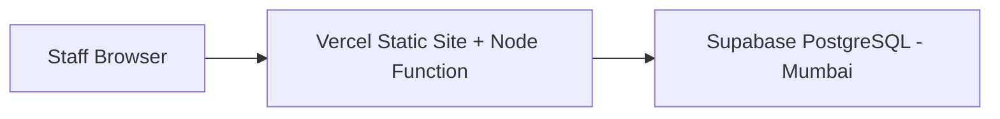
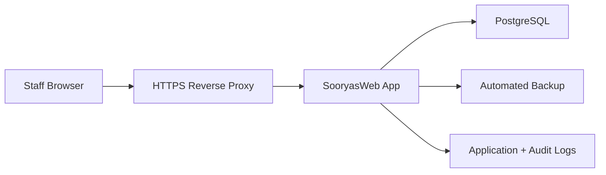

# Deployment

## 1. Current Prototype Run

```powershell
cd C:\Users\raghu\Prev_OneDrive\Documents\BeautyCareTutorials\SooryasWeb
npm.cmd start
```

Open:

```text
http://localhost:3000
```

## 2. Recommended Sooryas Internal URL

For Sooryas internal readiness, use:

```text
https://sooryas.lifefil.ai
```

The subdomain keeps the future white-label path clean.

## 3. Free-Tier Deployment Direction

The chosen free-tier path is now:



Use Vercel for the Next.js app and API routes. In Vercel, set the Vercel project root directory to `SooryasWeb/next-app` because this Git repository contains the app inside the `SooryasWeb` folder. Do not deploy the legacy repository root or the `SooryasWeb` root as the production app. Use Supabase for PostgreSQL. In the Supabase dashboard, copy the **Transaction pooler** connection string, not the direct connection string, because Vercel functions are serverless and use short-lived connections.

Set this Vercel environment variable:

```text
DATABASE_URL=postgres://postgres.<project-ref>:<password>@aws-0-ap-south-1.pooler.supabase.com:6543/postgres?sslmode=require
```

For the current private preview, also set:

```text
PGPOOL_MAX=1
SESSION_SECRET=<long random value>
ALLOW_PASSWORD_LOGIN=true
```

For the later Supabase Google authentication implementation, also set these before enabling real users:

```text
NEXT_PUBLIC_SUPABASE_URL=<supabase-project-url>
NEXT_PUBLIC_SUPABASE_ANON_KEY=<supabase-anon-key>
SUPABASE_SERVICE_ROLE_KEY=<server-only-service-role-key>
```

Vercel sets `NODE_ENV=production` automatically. `ALLOW_PASSWORD_LOGIN=true` is only a temporary preview/internal-pilot setting until Supabase Google authentication is implemented. Remove it before handling real customer data.

Configure Supabase Auth with Google provider before production preview:

1. Create a Google OAuth client for local, Vercel preview, and production redirect URLs.
2. Enable Google in Supabase Auth providers.
3. Keep portal access invite-only: a Google-authenticated email must match an active SooryasWeb user/invite with tenant and role.
4. Do not enable public self-registration into usable portal access.

Before first deployment, run the SQL in `data/schema.sql` manually in Supabase SQL Editor against a new empty project. Do not run the schema file against a database that already contains live data because the file is reset-oriented and contains `DROP TABLE` statements.

## 4. Prototype Hosting Caveat

The current prototype should not be exposed with real customer data until these are added:

- Supabase Auth Google provider;
- invite-only role-based access;
- durable database;
- HTTPS;
- backup process;
- audit log;
- privacy handling for consent and skin/hair/medical notes.

## 5. Phase 1 Production Shape

Longer-term paid production shape can still move back to a persistent app server if usage grows:



## 6. VPS Deployment Sketch

1. Install Node.js 22 or later.
2. Deploy the application folder.
3. Run the app with a process manager.
4. Reverse proxy HTTPS through Caddy or Nginx.
5. Configure database backups.
6. Restrict admin access.

Example app start:

```bash
PORT=3000 node src/server.js
```

Example Caddy reverse proxy:

```caddy
sooryas.lifefil.ai {
  reverse_proxy 127.0.0.1:3000
}
```

## 7. Backup Policy

Production:

- daily PostgreSQL backup during active operations;
- weekly retained backup after stabilization;
- pre-deployment backup before every release;
- test restore process before production launch.

## 8. Later White-Label Deployment

When Phase 3 begins:

- add tenant subdomain routing;
- isolate tenant data;
- add tenant provisioning workflow;
- standardize invoice template;
- allow tenant logo and settings;
- keep Sooryas Institute as a separate application and database.
